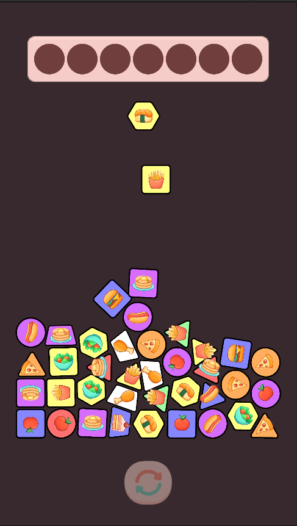
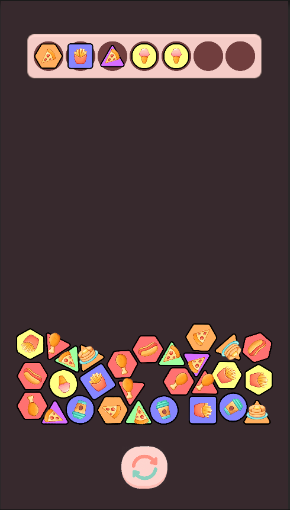
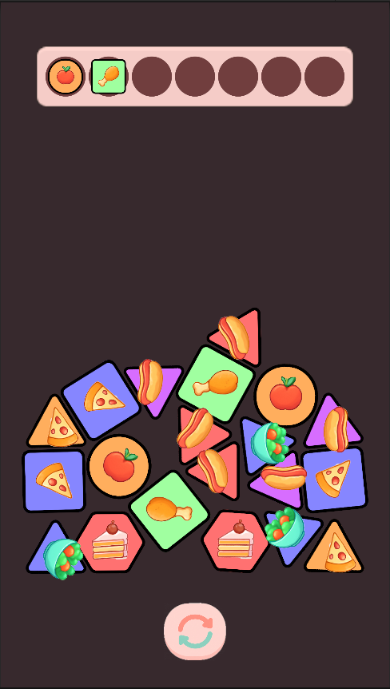
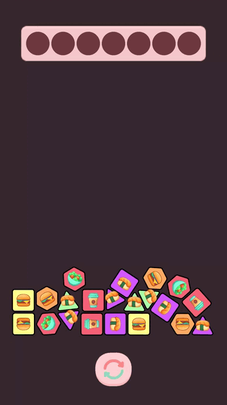

# Figures

## 🕹 Game Description
A prototype game with the mechanics of collecting different types of figures

## 🧠 The Goal of the Game
It is necessary to collect figures of the same variations. When collecting 3 identical figures, they disappear. Collecting all the figures is a victory, Filling the upper bar is a loss. You can regenerate the shapes with the button at the bottom

## 📱 Screenshots / Gifs
<p>
  
  
  
</p>
<p>
  
  
  
</p>

## 🎮 Gameplay Elements
### **Figures**

The main entities of the game. The figure consists of 3 components:
- **Shape**: Random geometric shape (Circle, Triangle, Square, etc.)
- **Color**: random background color
- **Internal element**: any element inside the figure that belongs to the same category (Food)

## 📦 Installation and Launch
1. Clone the repository:
   ```bash
   git clone https://github.com/protsenkovlad25/FiguresTest.git
   ```
2. Open the project in Unity (version 2022.3.45f1 or higher).
3. Launch the SampleScene via Assets/Scenes.
4. Press ▶ to start.

## ⚙️ Dependencies
- Unity 2022.3.45f1 LTS
- TextMeshPro
- DOTween

## 🔨 Build Instructions
1. Go to **File → Build Settings**
2. Select the **Android** platform
3. Click **Build**
4. Choose the build save location
5. The build is ready

## 🧪 TODO

## 👨‍💻 Contribution
